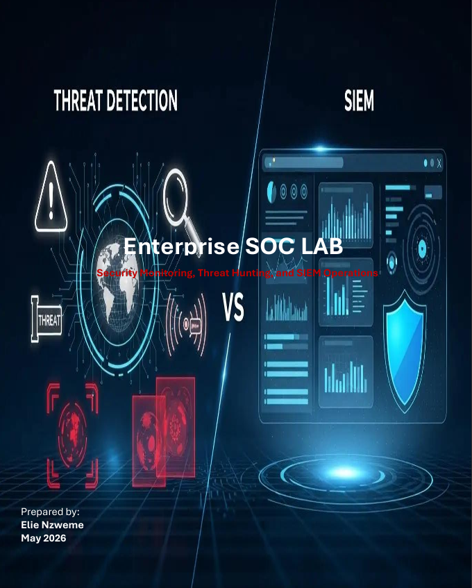
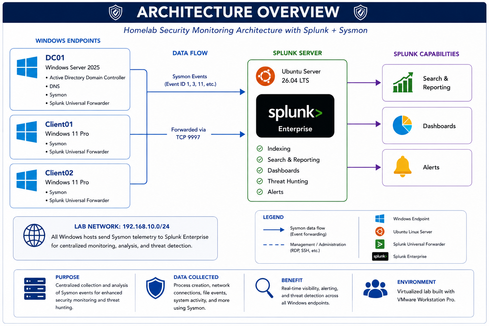
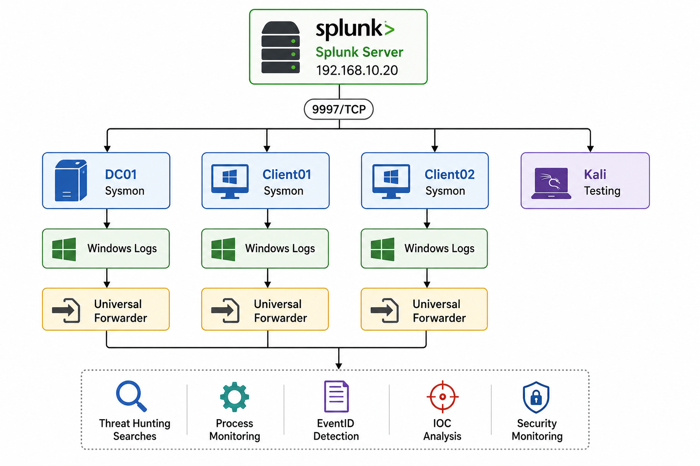
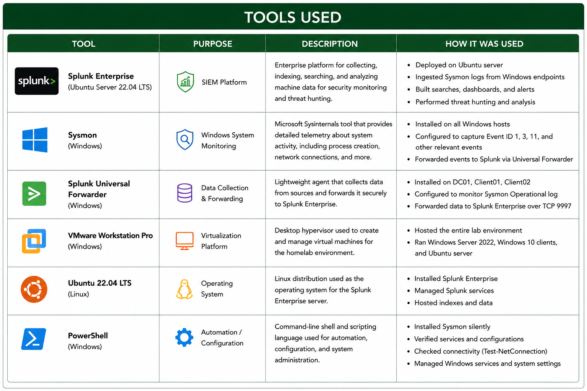
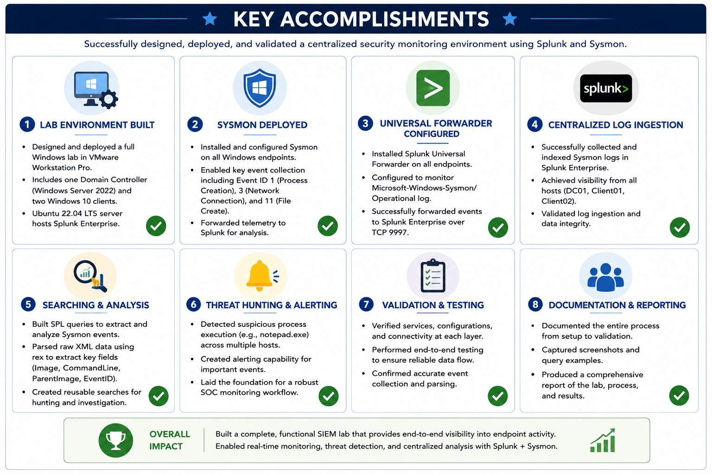
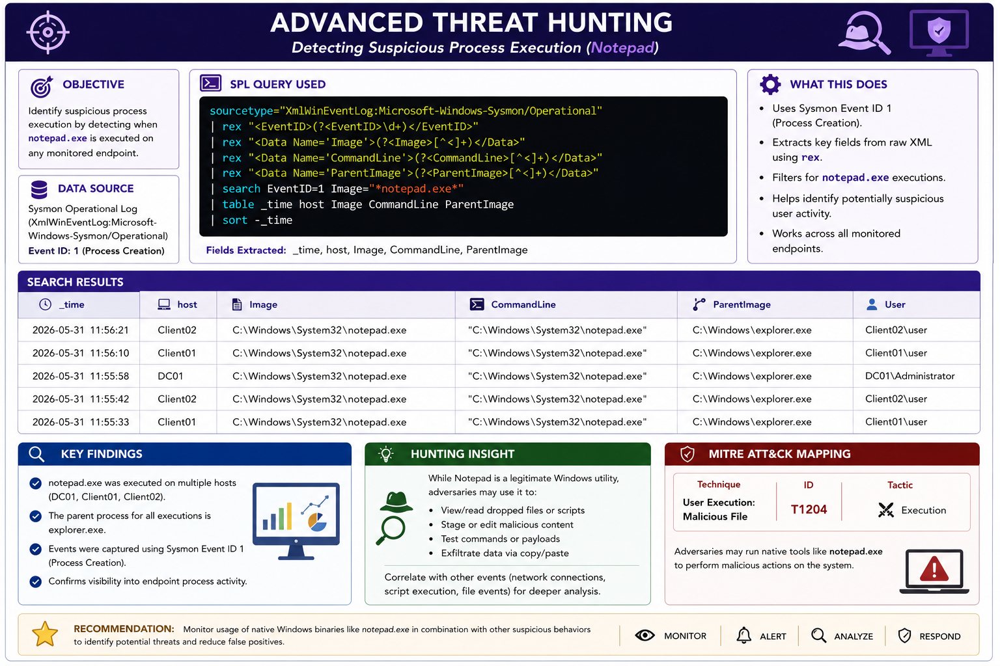

# Enterprise SOC Lab


<p align="center">
  
</p>

## Overview

This project demonstrates the design, deployment, and operation of an Enterprise Security Operations Center (SOC) Lab built using VMware Workstation Pro. The lab simulates a real-world enterprise environment by integrating Active Directory, Windows endpoints, Sysmon, Splunk Enterprise, and Splunk Universal Forwarders to provide centralized log collection, security monitoring, threat hunting, and incident investigation capabilities.

The primary goal of this project was to build an end-to-end security monitoring pipeline capable of collecting endpoint telemetry, forwarding security events to a SIEM platform, and enabling threat hunting through custom Splunk SPL searches.

---

## Project Walkthrough Video

This video demonstrates the Enterprise SOC Lab in action, including Active Directory, Splunk Enterprise, Sysmon monitoring, centralized log collection, and threat hunting using custom SPL searches.

[](https://www.youtube.com/watch?v=Ae4fnbrk93w)

---

## Full Documentation

📄 **Download the complete project report:**

[Enterprise SOC Lab Project PDF](docs/Enterprise%20SOC%20Lab%20Project.pdf)

---

## Lab Architecture

The following diagram illustrates the overall SOC lab architecture and communication flow between systems.



### Virtual Machines

| System | Operating System | Purpose |
|----------|-----------------|----------|
| DC01 | Windows Server 2025 | Active Directory Domain Controller |
| Client01 | Windows 11 Enterprise | Endpoint Monitoring |
| Client02 | Windows 11 Enterprise | Endpoint Monitoring |
| Splunk | Ubuntu Server | Splunk Enterprise SIEM |
| Kali Linux | Kali Linux | Security Testing & Validation |

---

## Security Monitoring Pipeline

The security monitoring pipeline collects telemetry from Windows endpoints, forwards logs through Splunk Universal Forwarders, and enables centralized threat hunting within Splunk Enterprise.



### Pipeline Flow

```text
Windows Endpoint
        ↓
      Sysmon
        ↓
Windows Event Logs
        ↓
Splunk Universal Forwarder
        ↓
TCP Port 9997
        ↓
Splunk Enterprise
        ↓
Indexing
        ↓
Field Extraction
        ↓
Threat Hunting
        ↓
Security Investigation
```

This pipeline enables security events generated on Windows systems to be collected, transported, indexed, and analyzed within Splunk Enterprise.

---

## Technologies Used

The following technologies were used to build and operate the SOC environment.



| Tool | Purpose |
|--------|---------|
| VMware Workstation Pro | Virtualization Platform |
| Windows Server 2025 | Active Directory Services |
| Windows 11 Enterprise | Endpoint Monitoring |
| Ubuntu Server | Splunk Hosting |
| Splunk Enterprise | SIEM Platform |
| Splunk Universal Forwarder | Log Collection |
| Sysmon | Endpoint Telemetry |
| SwiftOnSecurity Sysmon Config | Detection Rules |
| PowerShell | Administration & Troubleshooting |
| Active Directory | Identity Management |
| DNS | Name Resolution |

---

## Key Accomplishments

Major accomplishments achieved during the project.



- Built a multi-host Enterprise SOC environment using VMware Workstation Pro.
- Configured Active Directory Domain Services using Windows Server 2025.
- Deployed Splunk Enterprise on Ubuntu Linux.
- Installed Sysmon across multiple Windows systems.
- Configured Splunk Universal Forwarders for centralized log collection.
- Created an end-to-end security monitoring pipeline.
- Troubleshot Windows Event Log collection issues.
- Validated Sysmon telemetry across all monitored hosts.
- Successfully collected and analyzed Sysmon Event IDs 1, 3, 11, 13, and 22.
- Performed threat hunting using process creation telemetry.
- Developed custom Splunk SPL searches and field extraction queries.

---

## Sysmon Deployment

Sysmon was installed on:

- DC01
- Client01
- Client02

The SwiftOnSecurity Sysmon configuration was deployed to improve endpoint visibility and collect high-value security telemetry.

### Key Event IDs Collected

| Event ID | Description |
|-----------|------------|
| 1 | Process Creation |
| 3 | Network Connection |
| 11 | File Creation |
| 13 | Registry Modification |
| 22 | DNS Query |

---

## Splunk Universal Forwarders

Universal Forwarders were installed and configured on:

- DC01
- Client01
- Client02

Each forwarder was configured to:

- Forward Sysmon Events
- Forward Security Logs
- Forward System Logs
- Send telemetry to Splunk Enterprise on TCP 9997

---

## Validation Queries

The following validation searches were used during the project.

### Verify Endpoint Connectivity

```spl
index=* | stats count by host
```

---

### Verify Sysmon Event Collection

```spl
sourcetype="XmlWinEventLog:Microsoft-Windows-Sysmon/Operational"
| stats count by host
```

---

### Verify Available Sysmon Hosts

```spl
sourcetype="XmlWinEventLog:Microsoft-Windows-Sysmon/Operational"
| head 20
```

---

### Verify Sysmon Event Types

```spl
sourcetype="XmlWinEventLog:Microsoft-Windows-Sysmon/Operational"
| rex field=_raw "<EventID>(?<EventID>\d+)</EventID>"
| stats count by EventID
```

---

## Threat Hunting

Custom SPL searches were developed to identify process creation events, validate endpoint telemetry, and perform threat hunting investigations.



A threat hunting workflow was developed to identify process execution activity across monitored hosts.

### Process Creation Threat Hunting Query

```spl
sourcetype="XmlWinEventLog:Microsoft-Windows-Sysmon/Operational"
| rex "<EventID>(?<EventID>\d+)</EventID>"
| rex "<Data Name='Image'>(?<Image>[^<]+)</Data>"
| rex "<Data Name='CommandLine'>(?<CommandLine>[^<]+)</Data>"
| rex "<Data Name='ParentImage'>(?<ParentImage>[^<]+)</Data>"
| search EventID=1
| table _time host Image CommandLine ParentImage
| sort -_time
```

This query extracts:

- Process Name
- Command Line
- Parent Process
- Execution Time
- Host Information

allowing analysts to investigate process activity and identify potentially suspicious behavior.

---

## Notepad Threat Hunt

To validate Sysmon Event ID 1 detection, Notepad was executed on multiple endpoints.

### Validation Query

```spl
sourcetype="XmlWinEventLog:Microsoft-Windows-Sysmon/Operational"
| rex "<EventID>(?<EventID>\d+)</EventID>"
| rex "<Data Name='Image'>(?<Image>[^<]+)</Data>"
| search EventID=1 Image="*notepad.exe"
| table _time host Image
| sort -_time
```

Results confirmed successful process creation telemetry collection from:

- DC01
- Client01
- Client02

---

## Challenges and Resolutions

### Issue 1: Sysmon Events Not Appearing in Splunk

**Problem**

Initial Sysmon searches returned zero results.

**Root Cause**

Windows Event Log permissions prevented the Universal Forwarder from reading Sysmon logs.

**Resolution**

Configured the Splunk Forwarder service account with appropriate permissions and restarted the Splunk Forwarder service.

---

### Issue 2: Event IDs Not Extracted

**Problem**

EventID searches returned no results.

**Root Cause**

Event IDs were embedded within XML event data.

**Resolution**

Used regular expression (rex) extraction to parse EventID fields directly from raw XML events.

---

### Issue 3: Process Name Visibility

**Problem**

Process names were not searchable.

**Root Cause**

Image fields were embedded within XML payloads.

**Resolution**

Implemented field extraction using Splunk rex commands.

---

## Skills Demonstrated

- Security Monitoring
- SIEM Administration
- Splunk Enterprise
- Endpoint Telemetry Collection
- Sysmon Deployment
- Threat Hunting
- SPL Query Development
- Security Event Analysis
- Active Directory Administration
- Windows Server Administration
- Linux Administration
- Log Management
- Troubleshooting
- Incident Investigation

---

## Repository Structure

```text
Enterprise-SOC-Lab
│
├── diagrams
├── docs
├── queries
├── screenshots
├── LICENSE
└── README.md
```

---

## Future Improvements

- Deploy Wazuh SIEM
- Integrate Microsoft Sentinel
- Implement Sysmon Dashboards
- Create Splunk Alerts
- Add Detection Rules
- Integrate Nessus Vulnerability Scanning
- Expand Threat Hunting Use Cases

---

## Author

**Elie Nzweme**

Cybersecurity Analyst | SOC Analyst | IT Professional

GitHub: https://github.com/elienzweme

LinkedIn: https://www.linkedin.com/in/elie-nzweme-34a577239/

---
## Disclaimer

This project was conducted in a controlled lab environment for educational and portfolio purposes only. All systems were owned or authorized for testing. The techniques demonstrated should only be used against systems for which explicit authorization has been obtained.

---

## License

This project is licensed under the MIT License. See the [LICENSE](LICENSE) file for details.
